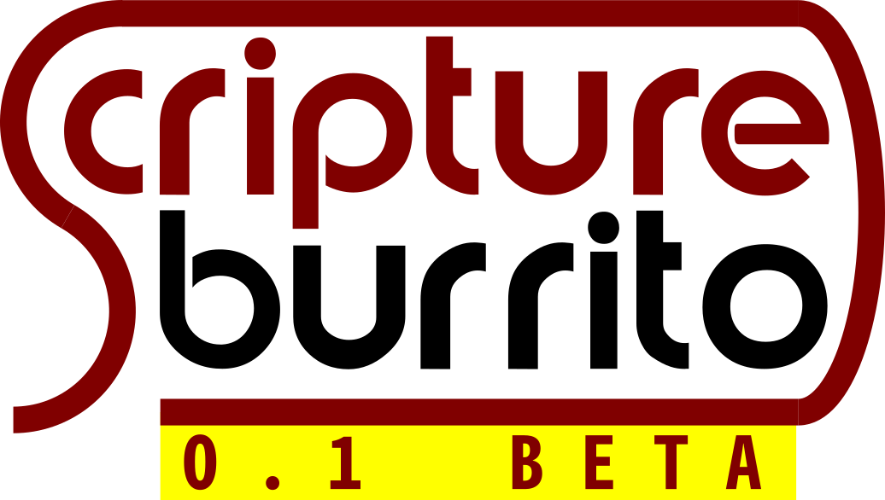

.. You can adapt this file completely to your liking, but it should at least
   contain the root `toctree` directive.

Scripture Burrito Documentation
===============================

This is the official documentation for the evolving Scripture Burrito standard. This version is **0.1.0 Beta**.

Status
------

This standard is work in progress. Things may well change significantly before v1.0.0. At this point the proposal includes:

* An explanation of the history and overall thinking behind the standard, particularly the metadata format

* A section-by-section presentation of the metadata format

* Notes on how the the metadata format may be extended, both informally and formally

* Examples of metadata documents in XML

* Examples of these metadata documents represented in JSON

* An XML schema (RelaxNG) for the metadata

Feedback
--------

Feedback may be provided via the `Technology.Bible forum <https://technology.bible/c/sb>`_ or via the `Scripture Burrito Github issues <https://github.com/bible-technology/scripture-burrito/issues>`_.

The :ref:`committee_members` invites comments on all aspects of this documentation, but has identified some specific issues about which decisions need to be taken:

XML vs JSON for metadata
........................

The current proposal specifies an XML schema for metadata, as well as a canonical way to represent that XML as JSON. This approach is derived from the current Digital Bible Library system.
XML documents are relatively easy for non-technical users to understand, and XML technology is mature and widely-supported.

However, it would also be possible to use JSON as the canonical format for Scripture Burrito metadata. This would have benefits for some software stacks - particularly Javascript - and may
make processing easier, but at the cost of reduced readability (especially for embedded XHTML).

(The committee would like to avoid specifying the format in both XML and JSON, as this is an invitation for arcane edge case incompatibilities. The current proposal does not do this, as
the only validation model is for XML, and JSON is simply an expression of that validated XML.)

USFM and USX for Scripture Text
...............................

The current proposal is based on the Digital Bible Library, which chose USX because it can be validated rigorously. As a result of this choice, several large publishing workflows including
YouVersion and API.Bible use USX.

Much of the Bible translation world uses USFM, which is familiar to
Bible translators, but which requires bespoke parsing tools, and which can be ambiguous in some circumstances. Also, USX contains machine-readable reference information that cannot be represented
in USFM at this time. Valid USFM can be round-tripped to USX. USX cannot be round-tripped to USFM without losing the machine-readable references. Invalid USFM may not have an equivalent
representation in USX.

Paratext currently uses both USFM and USX internally at various points.

The committee's current proposal is

* USFM for translations in progress

* USX for valid content, orientated towards publication (incremental or otherwise)

The committee would appreciate proposals for constructive and technically feasible alternatives.

Deadline
........

The window for feedback on Scripture Burrito 0.1.0 Beta extends until **Friday 25th October 2019**. Depending on the level of feedback, the committee hopes to produce v0.1.0 before the end of 2019. The development roadmap may be seen in the `Github milestones here <https://github.com/bible-technology/scripture-burrito/milestones?direction=asc&sort=due_date&state=open>`_.

Content
=======

.. toctree::
   :maxdepth: 4

   introduction
   generic_metadata
   flavors
   json
   extending
   appendices
