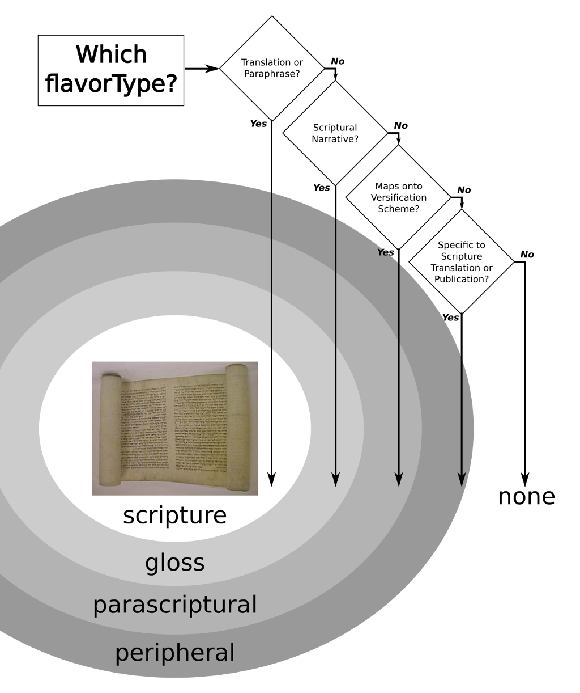

.. _schema_docs-design:

##############
Overall Design
##############

The design of the DBL Metadata schema has evolved as several curators have made changes to meet new needs.
Scripture Burrito metadata largely follows the design philosophy of DBL Metadata v2.2.

.. _schema_docs-design-flavortype:

Document "Shape" Determined by Type Elements
============================================

Scripture Burrito flavors are subdivided into four flavorTypes, on the basis of (roughly) how similar to Scripture they are.

* scripture

* gloss

* parascriptural

* peripheral.

The diagram below illustrates the logic behind the four flavorTypes - see also the detailed schema documentation. On a technical level, the more Scripture-like flavorTypes require more metadata, and specific ecosystems, applications and tool chains may only accept certain flavorTypes.

These flavorTypes are then subclassed into various flavors, as illustrated:

.. image:: https://user-images.githubusercontent.com/107731/62296968-3a43ba80-b43e-11e9-8a6b-f1d8982edb2a.jpeg

Metadata Filename
=================

A Scripture Burrito can exist in multiple data formats. When the metadata is written to disk it must be in a file with the name of ``metadata.json`` at the **root** level of the Burrito.

Other Burrito Files
===================

By convention, all files should be in the same directory as `metadata.json` or sub directories thereof. An acceptable exception is large media files that you may not want to distribute with the burrito itself, in which case a URL is acceptable. A burrito is intended to be a snapshot so maintaining external resources is beyond the scope of this specification. If files are references via URL, a client's expectation would be to get the same data each time it hits the provided URL.

File Encoding
=============

Files contained in a burrito should be encoded as UTF-8. Note that the `Unicode standard version 5 <http://www.unicode.org/versions/Unicode5.0.0/bookmarks.html>`_ notes the following about using the Byte order mark (BOM):

    Use of a BOM is neither required nor recommended for UTF-8, but may be encountered in contexts where UTF-8 data is converted from other encoding forms that use a BOM or where the BOM is used as a UTF-8 signature.

Flavor-Specific Details in One Known Location
=============================================

Most of the schema applies to all flavors of burrito. Flags and enums in the type section toggle various sets of functionality in a generic way.
Flavor-specific content is located in

* metadata/type/flavorDetails

Publications Inherit Burrito Properties
=======================================

The identification section contains many Dublin Core-inspired fields that relate to the Burrito as a whole. Similarly-named fields also exist,
optionally, within each publication. The fields in the identification section are assumed to apply to the publication unless alternative values
are specifically specified within the publication. Duplicate values between the identification and publication sections are legal but discouraged,
as human editing tends to result in unintended skew between the previously-identical values.

Versioning
==========

The Scripture Burrito specification follows `semantic versioning <http://semver.org>`_ in general. More specifically:

* in 0.X, we do not make an alpha / beta / release-candidate distinction
* effectively, all 0.X releases are alpha or beta
* planned releases are given a 0.X.0 version
* hot-fix releases to a 0.X (while we're working towards a different planned release) are given a version 0.X.Y (Y > 0)
* we will do alpha / beta / release candidates for 1.0 and beyond

Release Process
---------------

Prior to 1.0.0-rc1, there is no formal review process before release. All post-1.0 releases that aren't alpha or beta will go through a release candidate, however.

Post 1.0:

* alphas and betas can be done unilaterally by the release manager
* all release candidates for hot-fixes can be done unilaterally by the release manager but the actual release requires a review period and WG consensus
* all release candidates for normal (.0 / non-hotfix) releases require WG consensus

So for example, the release manager could unilaterally release:

* 0.4.0
* 0.4.1
* 1.0.1-rc1
* 1.1.0-alpha1
* 1.1.0-beta1

But working committee consensus is required for:

* 1.0.0-rc1
* 1.0.0
* 1.0.1
* 1.1.0-rc1
* 1.1.0

Branches
--------

Prior to 1.0, ``master`` contains the latest release (of any kind) and ``develop`` (into which feature branches are merged) contains the work towards the next release.

From 1.0 onwards, ``master`` will contain final releases (i.e. not alpha, beta, or rc).
